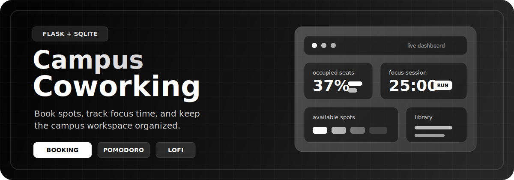
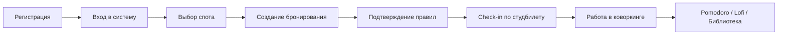

<p align="center">
  
</p>

<h1 align="center">Campus Coworking</h1>

<p align="center">
  Цифровая панель для университетского коворкинга: бронирование мест, профиль студента,
  Pomodoro, lofi-потоки, библиотека материалов и быстрый контроль загрузки пространства.
</p>

<p align="center">
  
  
  
  
  
</p>

<p align="center">
  <a href="#-что-внутри">Что внутри</a> •
  <a href="#-возможности">Возможности</a> •
  <a href="#-быстрый-старт">Быстрый старт</a> •
  <a href="#-api">API</a> •
  <a href="#-структура">Структура</a> •
  <a href="#-лицензия">Лицензия</a>
</p>

---

## ✦ Что это

**Campus Coworking** это Flask-приложение для управления студенческим коворкингом с акцентом на современный UI и понятный пользовательский поток:

- регистрация и вход по email;
- бронирование спотов с проверкой пересечений;
- подтверждение посещения по студенческому билету;
- настройка профиля, тем и аватара;
- встроенные инструменты для учебы: Pomodoro, lofi и библиотека материалов.

Проект хранит данные в `SQLite`, автоматически инициализирует базу при запуске и не требует отдельного backend-стека кроме Python и Flask.

## ✦ Визуальная идея

README сделан под тот же характер, что и сам интерфейс приложения: учебный дашборд, который выглядит не как очередная форма, а как полноценная цифровая рабочая станция для кампуса.

> Минималистичный backend, живой frontend, понятные правила бронирования и атмосфера реального студенческого пространства.

## ✦ Возможности

| Блок | Что умеет |
| --- | --- |
| Аутентификация | Регистрация, вход, сессии, валидация email и студенческого билета |
| Профиль | Аватар, избранный спот, персональная тема интерфейса |
| Бронирование | Создание брони, контроль длительности, защита от пересечений |
| Check-in | Подтверждение входа по номеру студенческого билета и правилам |
| Дашборд | Список спотов, статистика бронирований, история активности |
| Productivity | Pomodoro 25/5, lofi-плеер, учебная библиотека |
| Campus Extras | Подсказки по точкам питания рядом со спотом |

## ✦ Почему проект смотрится сильнее обычного CRUD

| Обычный учебный проект | Здесь |
| --- | --- |
| Сухая форма с таблицей | Полноценный интерфейс дашборда |
| Только база и логика | Плюс темы, музыка, таймер и библиотека |
| Формальные сущности | Сценарий реального использования в кампусе |
| Несвязанный UI | Единый визуальный стиль и единый пользовательский поток |

## ✦ Стек

```text
Backend  : Python, Flask, SQLite, Werkzeug
Frontend : HTML, CSS, Vanilla JavaScript
Storage  : SQLite database + локальные аватары
UX       : themes, dashboard cards, music embeds, productivity widgets
```

## ✦ Пользовательский сценарий



## ✦ Что внутри

### Интерфейс

- боковая панель с профилем и настройками;
- карточки спотов с выделением избранного;
- форма бронирования с ограничением шага по времени;
- таблица бронирований;
- модальное окно подтверждения правил;
- лента lofi-потоков и учебная библиотека.

### Серверная логика

- автоинициализация таблиц в `SQLite`;
- сидирование спотов и точек питания;
- контроль конфликтов по времени и вместимости;
- обновление профиля и загрузка аватара;
- API для правил, спотов, бронирований, профиля и check-in.

## ✦ Быстрый старт

### 1. Клонирование

```bash
git clone <your-repo-url>
cd KworkingSystem
```

### 2. Виртуальное окружение

```bash
python3 -m venv .venv
source .venv/bin/activate
```

### 3. Установка зависимостей

```bash
pip install Flask==2.3.3 Werkzeug==2.3.7
```

### 4. Запуск

```bash
python3 main.py
```

После запуска приложение будет доступно по адресу:

```text
http://0.0.0.0:5000
```

База `coworking.db` инициализируется автоматически. Аватары сохраняются в `static/uploads/avatars/`.

## ✦ Переменные окружения

| Переменная | Назначение | Значение по умолчанию |
| --- | --- | --- |
| `COWORKING_SECRET` | ключ Flask-сессий | генерируется автоматически |
| `PUBLIC_URL` | публичный адрес приложения | встроенный `tuna` URL |
| `AUTH_SHOWCASE_IMAGE` | изображение на auth-экране | URL изображения |
| `ASSET_VERSION` | версия статики | `20260216-05` |
| `HOST` | адрес bind | `0.0.0.0` |
| `PORT` | порт приложения | `5000` |

Пример запуска с переменными:

```bash
COWORKING_SECRET="super-secret" PORT=8000 python3 main.py
```

## ✦ API

### Основные маршруты

| Метод | Endpoint | Назначение |
| --- | --- | --- |
| `GET` | `/api/rules` | получить правила коворкинга |
| `POST` | `/api/register` | зарегистрировать пользователя |
| `POST` | `/api/login` | выполнить вход |
| `POST` | `/api/logout` | завершить сессию |
| `GET` | `/api/me` | получить текущего пользователя |
| `GET` | `/api/spots` | список доступных спотов |
| `GET` | `/api/snacks/<spot_id>` | ближайшие точки питания |
| `GET` | `/api/bookings` | список бронирований |
| `POST` | `/api/bookings` | создать бронирование |
| `POST` | `/api/bookings/<booking_id>/check-in` | подтвердить вход |
| `POST` | `/api/profile` | обновить профиль |
| `POST` | `/api/avatar` | загрузить аватар |
| `POST` | `/api/rules/ack` | подтвердить правила |

### Пример регистрации

```http
POST /api/register
Content-Type: application/json

{
  "email": "student@university.edu",
  "nickname": "stud_01",
  "first_name": "Иван",
  "last_name": "Иванов",
  "student_id": "0БИН12345",
  "password": "securepass123"
}
```

### Пример создания бронирования

```http
POST /api/bookings
Content-Type: application/json

{
  "spot_id": 1,
  "start_at": "2026-04-16T14:30:00",
  "end_at": "2026-04-16T15:30:00"
}
```

## ✦ Структура

```text
KworkingSystem/
├── main.py
├── coworking.db
├── README.md
├── LICENSE
├── templates/
│   ├── auth.html
│   └── index.html
└── static/
    ├── app.js
    ├── auth.js
    ├── styles.css
    └── uploads/
        └── avatars/
```

## ✦ Подход к данным

- пользователи, споты, бронирования и точки питания лежат в `SQLite`;
- список спотов и snack zones сидируется из Python-констант;
- временные конфликты бронирования проверяются на сервере;
- доступ к API, связанному с пользователем, защищен сессией.

## ✦ Для кого этот проект

- для учебного портфолио;
- для демонстрации Flask + SQLite + Vanilla JS;
- для курсовой или лабораторной с сильной визуальной подачей;
- для прототипа университетского сервиса.

## ✦ Лицензия

Проект распространяется по лицензии **MIT**. Полный текст находится в файле [LICENSE](LICENSE).

---

<p align="center">
  Сделано как проект, который должен выглядеть не просто рабочим, а убедительным.
</p>
